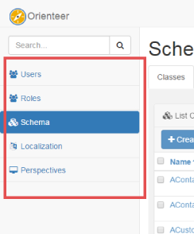

# Managing the Data Model

Before you start building your schema, we recommend that you **plan your data model beforehand**. For example, you can first draw your data model in a UML diagram. Later  you will create classes in a schema, set their properties and connections. This will be easier for you to make if you refer to a data model diagram.

>**Tip!** After you build your model, you can build a UML diagram for the classes that you created and compare them with your plan. This will give you an extra verification.

In this chapter, you will need to move from page of the database to page to make configurations. This guide will show how you access these pages over the navigation pane, when you are working in the default administrator's perspective. This perspective includes five pages (see the picture).

In [perspectives other than the default administrator's perspective](https://orienteer.gitbooks.io/orienteer/content/managing_users.html) there may be a different set of links on the navigation page. So, each time you will need to access another page, the guide will additionally provide a URL for accessing the page for the case you cannot do this on the navigation pane. The reference will look like &lt;database URL&gt;/&lt;page reference&gt;. For example, this could be *mydatabase.orienteer.org/schema*.
