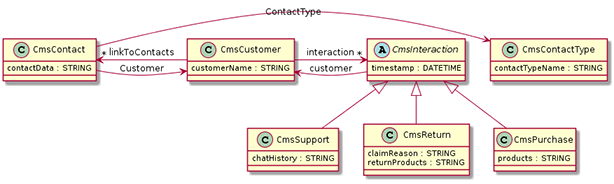

# Deriving Classes

---
 This part will guide you through deriving subclasses from a parent class in Orienteer.

---

So far, we store information about interaction with each customer in a string record. This record is voluntarily filled by the CMS operator. We want there to be just three pre-defined types of interaction: purchase, return, support. Each will have a timestamp and a description.

The three types of interaction have common features (they have a timestamp), but they will also differ in some parameters. So, this is natural to create an abstract class *Interacton* with common properties and three derived subclasses.

Steps to go:
1. Create a class *CmsInteraction*. In its parameters, check the box **Abstract**.
2. For this class, create properties:
  * *customer*:
    * Type: LINK
    * Linked Class: CmsCustomer
  * *timestamp*: 
    * Type: DATETIME
3. On the page of the *CmsInteraction* class, go to the tab **Subclasses**. Do the following:
  * Create the derived class *CmsPurchase*:
    * On the **Properties** widget, click **Save** to confirm the inherited properties.
    * Create the class-specific string property *products* that will store the list of purchased products.
  * Derive the class *CmsReturn* with specific string properties *returnProducts* and *claimReason*.
  * Derive the class *CmsSupport* with the specific string property *chatHistory*.

4. In the class *CmsCustomer*, we already have the string-type property *interaction*, but we want it to be link-type. 

   So, delete the property *interaction* and create a new property with similar name with parameters:
   * Type: LINKLIST
   * Visualization: table
   * Linked Class: CmsInteraction
   * Inverse: customer.
5. For the class *CmsInteraction*, for the property *customer* set Inverse: interaction.
6. Let us also have interactions for each customer on a separate tab. So, for the class *CmsCustomer*, for the parameter *interactions*, set Tab: Interactions.

So, now can log our interactions with clients on a separate tab. Let's view the new UML.

