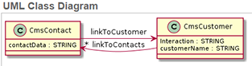
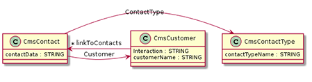

# Developing The Data Model

We will build a simple data model and augment it in a step-by-step manner. 
We will build a basic CRM app that will store client names, contacts and the type of their interaction with the company (interested, purchase, support). We will go through minimal steps to have a viable app.

## Creating a Class
> This part will guide you through creating a class, setting its properties and creating an instance of the new class (a document).

We will start with the simplest model, with only one class, *Customer*. It will have properties *Customer name*, *Contacts* and *Interaction*.

1. Go to page */schema*.
2. To create a new class, сlick **Create**.
3. On the class page, fill the parameter Name: *CmsCustomer*, then click **Save**.
4. On the widget **Properties** create three properties by clicking **Create**. Set their  parameters and click **Save**. 
  * For the *customerName* property, set the parameters:
    * Name: customerName
    * Type: String
  * For the *contact* property, set the parameters:
    * Name: contact
    * Type: String
  * For the *interaction* property, set the parameters:
    * Name: interaction
    * Type: String

5. Specify which of the parameters will identify a document. In our case each document corresponds to a customer's name. So, in the class *CmsCustomer*, on the widget *Configuration*, set the parameter **Document Name Property**: *customerName*.

Now we can create documents of the class Customer. Each document will correspond to a person.

Once we want to add a new customer or to edit an existing one, we will need to go to the list of class's documents.
1. Go to /browse/Customer (otherwise, you could go to /schema and in the line Customer, on the right, click **Browse Class**).
2. To create a new document, click **Create**.
3. Now you can fill new client's data and save it.

## Linking Classes and Managing Property Visualization
> This part will guide you through linking classes. You will also learn how to display properties on separate tabs and how to enable basic UI to manage properties of a document.

In the app we've just created, we store all contacts in a single field, like skype, telephones, emails etc. Now let us make it so that each customer may have several separate contact records. These contacts will show on a separate tab of each customer.

Do the following:
1. From the class *CmsCustomer* delete the property *contact*. We will store contacts in a different way. 
2. Create a new class for storing contacts, *CmsContact*

  We want each customer's contact to be stored as a separate item. This is why we will create a separate class for contacts. We will be able to add as many documents of this class as needed to each customer.
  
3. We will link the *CmsContact* and the *CmsCustomer* classes. For this, we will add special LINK properties to both classes:
  *  To the *CmsCustomer* class we add a property *linkToContacts* with following parameters:
    *  Type: LINKLIST
    *  Linked Class: CmsContact
  *  To the *CmsContact* class we add a property *Customer* with following parameters:
    * Type: LINK
    * Linked Class: CmsCustomer
    * Visualization: listbox (this will let the user select the linked customer for a contact from a drop box).
    *  Inverse: linkToContacts (here you choose a back link from the list of link type parameters of the linked class, *CmsCustomer*).
  *  Go back to the *CmsCustomer* class and edit the parameter *linkToContact*. Set the parameter **Inverse** similarly, by selecting the property *Customer*.

4. We want each customer's contacts to show on a separate tab. For this, in the class *CmsCustomer* we edit the link property *linkToContacts*. Set the following parameters:
  * Tab: Contacts. Now a separate tab named *Contacts* will show the list of contacts linked to the particular customer.
  * Visualization: table. This enables UI elements like **Create** or **Save** buttons etc, that will be handy for creating and managing contacts.

5. In the previous step, we have changed the visualization of a property. Whenever we will look through the list of customers (the documents of the class *CmsCustomer* on the page /browse/CmsCustomer), this property, with its buttons and other elements, is not useful. We want to hide it from the document list.
   
   To do this, for each property of the class *CmsCustomer* set its parameter **Displayable**. Check it for the properties *customerName* and *interaction* and uncheck it for the property *linkToContacts*.

With this, we are done for this part. Now, when you create a customer, you do not give its contacts, only their name and stage of interaction. To add contacts, you will go to each customer's page and on a separate tab **Contacts** add as many contacts as you need.

##Viewing the UML of the Data Model

> This part will help you view the UML of your data model.

Now that we have several classes implemented, we can view them all on an UML diagram.

On the schema page, check the classes *CmsCustomer* and *CmsContact*. Then click . You will see the two classes with their links and properties on an UML diagram.

## Making a Document Property Selectable from a List

Now we can make several contats for a client. But if we'd like to index them, we will face the fact that the app operators type in the data in a very different style. Just think of how many ways there are to write the work *email*!

So, for each contact, we want the operators to select the contact type (email, skype etc) from a drop box.

For this, we will create yet another class, *CmsContactType*. This class will contain three instances (documents) that will represent the allowed contact types.

1. Create the class *CmsContactType* with just a single STRING type property, *contactTypeName*.
2. In this class, create four documents: 
  * *email* 
  * *skype*
  * *snail mail*
  * *telephone* 
3. In the class *CmsContact*, add a property *ContactType* with following parameters:
  * Type: LINK.
  * Visualization: listbox (this will let the user select the type of contact from a drop box).
  * Linked Class: CmsContactType.

Now you can check any customer's contacts. When you add a new contact or edit an existing one, you will have a drop box to select from a pre-defined set of values.

Let's check the new UML:

##Deriving Classes
In this part, we will derive several subclasses from a parent class. 

So far, we store information about interaction with customers in a string record of each customer. This record is voluntarily filled by the CMS operator. 

We want this to be more formalized. We want there to be three types of interaction: purchase, return, support. Each will have a timestamp and a desctiption.

The three types of interaction have common features (they have a timestamp), but they will also differ in some parameters. So, this is natural to create an abstract class *Interacton* with common 

## Scaling the Data Model
