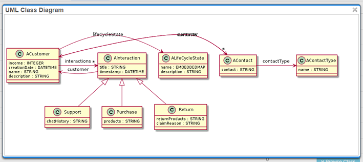

#Managing Classes

To create a class, on the schema page ([..]/schema), on the **Classes** tab, click . You will be guided to the class page.

After you create a class, you can always return to editing it by clicking its name in the list on the schema page.

##Editing Class Parameters

On the **Configuration** tab, on the **Configuration** widget, you can set class parameters:

* **Name** is the class name that will show on the **Schema** page. When giving a name to a class, follow the [Schema naming convention](https://github.com/OrienteerDW/Orienteer/wiki/Schema-naming-convention).
* **Short Name** is a short alias for the class name used in SQL to simplify wording.
* **Description** is a description of the class.
* **Super Classes** sets the class's parent class.
* **Over Size** is the factor that sets the extra free storage space for documents. E.g. value 2 will spare free storage space for documents twice as large as their current space. You can use this parameter for performance optimization.
* **Strict Mode**, checking this box will prevent documents of this class having extra properties not defined for the class.
* **Abstract**, ckecking this box makes the class abstract. This prevents the creation on documents of this class. Abstract classes are used only as parents to other classes.
* **Java Class** is the name of the original java class from which this class was generated. For manually created classes, its value is null. 
* **Cluster Selection** defines the [strategy for cluster selection](http://orientdb.com/docs/last/Cluster-Selection.html).
* **Document Name Property** sets the parameter of the class, the value of which will show as a document's name in the list of documents.
* **Parent Document Property** sets the name of a property which refers to logical parent of an instance of this class. Parent hierarchy allows for easier navigation through you data.
* **Default Tab** sets the tab that will show by default when you open a document.
* **Default Sorting** defines property used by default for sorting.
* **Default Sort Order** defines the default sorting order.

##Managing Class Properties

On the **Configuration** tab, on the **Properties** widget, you can create class properties and make some of their settings. To edit more, you can go to the property page by clicking its name.

On the property page, on the **Configuration** tab, you can set the following:
* **Name** and **Description** are what it says.
* **Tab**:  if you give a name for a tab here, the property will show on a separate tab.
* **Order** sets the order in which this property shows: after other properties with smaller **Order** value and before the rest.
* **Type** sets the data type of the property (for the list of available data types see [OrientDB manual](http://orientdb.com/docs/last/Types.html)).
* **Visualization** defines way the property value is visualized (for the list of available visualisation types, see [supplementary](https://orienteer.gitbooks.io/orienteer/content/supplementary_supported_visualisation_types.html)).
* **Linked Class** lets you connect the class with another class.
* **Inverse** sets inverse property for linkage properties.
* **Mandatory** makes this property mandatory for creating a document.
* **ReadOnly** makes this property read-only in UI on the API level.
* **UI ReadOnly** makes this property read-only in UI.
* **Not Null** sets that value of this property can't be null.
* **Min** and **Max** defines the limits for quantifiable properties.
* **Regexp** sets a pattern for value of this property.
* **Collate** defines collate strategy. Commonly it's default or 'ci' (case insensitive).
* **Displayable** says if a property will be displayed in the list of documents of this class.
* **Hidden** hides a property from the UI.
* **Calculable** makes [calculable properties](https://orienteer.gitbooks.io/orienteer/content/adding_calculable_properties.html) (may require experience in coding).
* **Default Value** sets the default value of the property.

You can add custom properties to a class. You can do it on the class page, on the **Configuration** tab, on the **Custom properties** widget.

##Managing Class Indexes

To create an index, on a class page, on the **Properties** widget, select properties that you want to be in the index and then click . The index page will open.

After you create an index, you can always return to editing it by clicking its name on the class page, on the **Configuration** tab, on the **Indexes** widget. Alternatively, you can check them on the schema page, on the **Indexes** tab.

To learn more about indexes in OrientDB, see http://orientdb.com/docs/last/Indexes.html.

## Viewing the Data Model on a Diagram

You can view your data model on a UML diagram. On the **Scheme** page, check the classes that you want to see on the diagram and at click .

