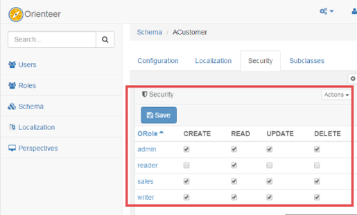

# Setting Security

Orienteer approach to security is based on [OrientDB security settings](http://orientdb.com/docs/2.1/Database-Security.html) and supports security on several levels.

## Class level security

At the level of each class, you can define which roles can do what. For this, [go to the page of a  class](https://orienteer.gitbooks.io/orienteer/content/managing_classes.html), the **Security** tab.

## Roles security rules

At the level of roles, you can 
For this, [go to the page of a role](https://orienteer.gitbooks.io/orienteer/content/managing_users.html), the **Security** tab, and define specific security rules for the role. To read more about making rules, see [OrientDB guide](http://orientdb.com/docs/2.1/Database-Security.html).

## Document based security

Details here: http://orientdb.com/docs/2.1/Database-Security.html#record-level-security

But simply saying: if a class extends ORestricted - security can be defined on document by document basis.  For example it's possible to make document visible just for 1 user. 