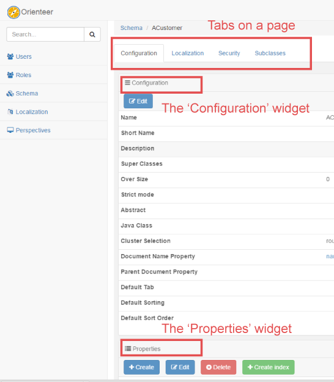

# Understanding Orienteer UI

The Orienteer UI is based on several basic concepts.

## Pages and perspectives
An Orienteer app is displayed as a set of **pages**. Some pages may be universal for all Orienteer apps, like *Users* or *Classes*. Others will be specific to particular apps. Users can access pages by clicking their links (e.g. on the navigation pane) and [via their URLs](https://orienteer.gitbooks.io/orienteer/content/special_urls.html).

A **perspective** defines what pages are available for the user on the navigation pane and what is the default page that a user sees after logging in. 

Example (the default perspective):

For each user role, the Orienteer app administrator allocates a set of available perspectives. To select another perspective, click  on the top right.

## Tabs, dashboards and widgets

What the user sees on a page is a **dashboard**. On a dashboard, there can be several **widgets** that display a variety of data. These may be tables, graphs, custom widgets developed for a particular app. Selecting other **tabs** on the page, user will see other widgets.

Example: the default dashboard of a class contains several widgets *Configuration*, *Properties*, *Indexes*, *Custom properties*. The user can also select between tabs: *Configuration*, *Localization*, *Security*, *Subclasses*.

widget's domains ...