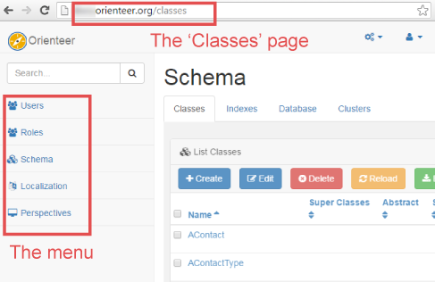

# Understanding Orienteer UI

The Orienteer UI is based on HTML5. Its adoptive design makes Orienteer suitable for desktop, tablet and mobile devices.

## Pages and perspectives
An Orienteer app is displayed as a set of **pages**. Some pages are common for all Orienteer apps, like "Users" or "Classes". Other pages are specific to particular apps. You can access pages by clicking their links (e.g. on the menu) and via their URLs. [Here](https://orienteer.gitbooks.io/orienteer/content/special_urls.html) you can check URLs of common Orienteer app pages.  

**Perspectives** are used  to personalize UI for different user roles. For example, in your app, you may have 1) a perspective for executive managers with business analysis dashboards and 2) another perspective for customer service operators with their everyday operational activities. A perspective defines menu structure and generic UI properties, like user's home page. 

Example (the default perspective in Orienteer):

To switch between perspectives, click  on the top right and select the one you need.

## Tabs, dashboards and widgets

What the user sees on a page is a **dashboard**. On a dashboard, there can be several **widgets** that display a variety of data. These may be lists, tables, graphs, custom widgets developed for a particular app. Selecting other **tabs** on the page, a user will see other widgets.

Example: the default dashboard of a class, on its default tab, contains several widgets: *Configuration*, *Properties*, *Indexes*, *Custom properties*. The user can also select between tabs: *Configuration*, *Localization*, *Security*, *Subclasses*.

To add new widgets, re-size and move them around on the dashboard, click   on the top right of the dashboard. 

You can add the pre-defined Orienteer widgets only to particular pages. The set of these pages is a wiget's scope.

|Page|URL|Scope in Orienteer 1.1|
| -- | -- | -- |
|ODocumentPage|/doc/&lt;rid&gt;|Schema class of a document|
|BrowseOClassPage|/browse/&lt;class name&gt;|Schema class|
|SchemaPage|/schema or /classes|Global|
|OClassPage|/classes/&lt;class name&gt;|Global|
|OPropertyPage|/property/&lt;class name&gt;/&lt;property name&gt;|Global|
|OIndexPage|/index/&lt;index name&gt;|Global|
