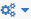

# Understanding Orienteer UI

The Orienteer UI is based on several basic concepts.

## Perspectives
A perspective defines what pages are available for the user on the navigation pane and what is the default page that a user sees after logging in. 

Example (the default perspective):

Each user role has a [set of available perspectives](https://orienteer.gitbooks.io/orienteer/content/orienteer_user_interface.html) to select from, one of which is default. When a user logs in, he views the default perspective. To select another perspective, the user will need to click  on the top right.

## Widgets

widget's domains

## Dashboards
dashboard
